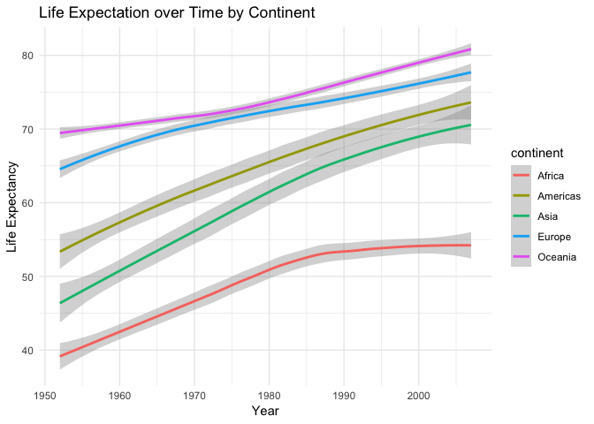
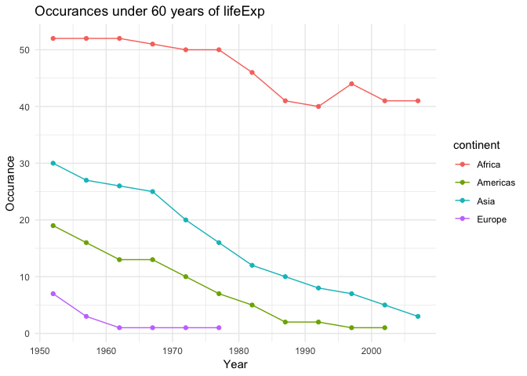
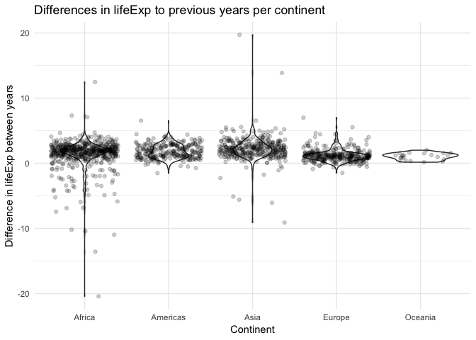

Homework 3: Datamanipulation with dplyr/ggplot2
================

## Load `gapminder` and `tidyverse` packages.

First things first. Before we can start the analysis we have to install
and load the necessary dataset and metapackage. We can install a package
typing `install.packages("package_name")` in the console and afterwards
load these as follows:

``` r
library(gapminder) # to load the gapminder package
library(tidyverse) # to load the tidyverse package which contains dplyr
```

    ## ── Attaching packages ───────────────────────────────────────────────────────────────────────── tidyverse 1.2.1 ──

    ## ✔ ggplot2 3.0.0     ✔ purrr   0.2.5
    ## ✔ tibble  1.4.2     ✔ dplyr   0.7.6
    ## ✔ tidyr   0.8.1     ✔ stringr 1.3.1
    ## ✔ readr   1.1.1     ✔ forcats 0.3.0

    ## ── Conflicts ──────────────────────────────────────────────────────────────────────────── tidyverse_conflicts() ──
    ## ✖ dplyr::filter() masks stats::filter()
    ## ✖ dplyr::lag()    masks stats::lag()

In the followign I will explore 3 different tasks and present my results
in tables and graphs:

1.  How is life expectancy changing over time on different continents?
2.  Report the absolute and/or relative abundance of countries with low
    life expectancy over time by continent: Compute some measure of
    worldwide life expectancy – you decide – a mean or median or some
    other quantile or perhaps your current age. Then determine how many
    countries on each continent have a life expectancy less than this
    benchmark, for each year.
3.  I chose my own question: Is life expectancy declining or increasing
    for each continent for each year? And which country experienced the
    worst decline in life expectancy over a 5-year period?

# Coding on the shoulders of giants

The first lesson I learned in coding is that coding is not a process in
which one sits alone at home in front of his desk and has absolutely no
contact to the outer world, the proper nerd image also. Instead, writign
code or hacking is a creative process in whihc one heavily relies on the
**community**. Where would R be now if
[**ROpenSci**](https://ropensci.org) would not be as successfull?

**It is therefore extremely helpful to connect with the open source
community, read through documentation and blog posts that are already
out there.** Like in science we can *code on the shoulder of Giants*,
there is no need to reinvent the wheel.

My first approach to this task therefore is to quickly scan through the
`gapminder` documentation and examples and some blog
posts:

``` r
?gapminder # opens the gapminder documentation in the helper window in RStudio
```

Some helpful blog posts and internet documentation I found about
gapminder include:

  - [Gapminder Exploratory Data
    Analysis](https://rpubs.com/angiechen/224550)
  - [Introduction to tidyverse](https://rpubs.com/madhulika189/375193)
  - [official tydiverse website](https://www.tidyverse.org)
  - and out of interest Hadley Wickhams paper about [tidy
    data](https://www.jstatsoft.org/article/view/v059i10)

Using these references, and the communitys help lets analyse some data.

# How is life expectancy changing over time on different continents?

To answer this question I would like to start comparing different life
expectancy values in a visualisation. I checked `?geom_smooth()` in the
console and find its description fitting for these purposes: \> Aids the
eye in seeing patterns in the presence of overplotting.

I also just recently discovered that one can adjust or change the
overall theme of ones plots by adding`theme_<new_theme>()`. The
[documentation](https://ggplot2.tidyverse.org/reference/ggtheme.html)
provides an overview to which themes can be used.

We are ready to plot
now:

``` r
gapminder %>% # Let's pipe the gapminder dataset into a plotting function
  ggplot(aes(year, lifeExp)) + # our aestetics are year on the x axis and lifeExp on the y axis
  geom_smooth(aes(colour = continent), method="loess") + # using the geom_smooth() geometry and colouring data by continent
  ggtitle("Life Expectation over Time by Continent") + # adding a title
  xlab("Year") + ylab("Life Expectancy") + # adding x and y labels
  theme_minimal()
```

<!-- -->

As we can see in the visualisation life expectancy rose from 1952-2007
for every continent. Life expectancy in Africa almost platoed starting
form the 1990th and did not rise significantly until 2007. In
comparison, life expectancy in Oceania is the highest and in Africa the
lowest.

Let’s check the exact values in a table. I am interested in seeing
minimum, maximum and median values for life expectancy grouped by
continent. I would also like to look at the values for different years
separately to keep the tables
readable:

``` r
df <- gapminder %>% # I create a variable df I can reuse to look at different years
      group_by(continent, year) %>% # grouping the dataframe by continent and year
      summarize(medianLifeExp = median(lifeExp), # creating a summary of min, max and median
                minLifeExp = min(lifeExp),
                maxLifeExp = max(lifeExp))
df %>% 
  filter(year==1952)
```

    ## # A tibble: 5 x 5
    ## # Groups:   continent [5]
    ##   continent  year medianLifeExp minLifeExp maxLifeExp
    ##   <fct>     <int>         <dbl>      <dbl>      <dbl>
    ## 1 Africa     1952          38.8       30         52.7
    ## 2 Americas   1952          54.7       37.6       68.8
    ## 3 Asia       1952          44.9       28.8       65.4
    ## 4 Europe     1952          65.9       43.6       72.7
    ## 5 Oceania    1952          69.3       69.1       69.4

``` r
df %>% 
  filter(year==2007)
```

    ## # A tibble: 5 x 5
    ## # Groups:   continent [5]
    ##   continent  year medianLifeExp minLifeExp maxLifeExp
    ##   <fct>     <int>         <dbl>      <dbl>      <dbl>
    ## 1 Africa     2007          52.9       39.6       76.4
    ## 2 Americas   2007          72.9       60.9       80.7
    ## 3 Asia       2007          72.4       43.8       82.6
    ## 4 Europe     2007          78.6       71.8       81.8
    ## 5 Oceania    2007          80.7       80.2       81.2

Comparing the values for the two years 1952 and 2007 we can for example
see, that the minimum life expectancy of 28 years in Asia in 1952 rose
to 39 years in Africa in 2007. Oceania’s median life expectancy rose
from 69 to 80 years and has been ahead of all other continents if one
compares the mean. In Aisa we can however detect that there are countrys
with a life expectancy as high as 82 years in 2007. I am curious now,
let’s check which Asian country has such a high life expectancy in 2007:

``` r
gapminder %>% 
    filter ( year == 2007) %>%  
    top_n(n=1, lifeExp) # Using top_n allows me to select the top or bottom entry in a group.
```

    ## # A tibble: 1 x 6
    ##   country continent  year lifeExp       pop gdpPercap
    ##   <fct>   <fct>     <int>   <dbl>     <int>     <dbl>
    ## 1 Japan   Asia       2007    82.6 127467972    31656.

People in Japan live the longest in 2007.

NOTES:

  - I love documentation, this is my go to life saver. Especially using
    `?` in the console.
  - I found it very hard to generate a table that summarizes all values
    for 2007 and 1952 and is still readable. Therefore I decided to
    create a df that can be reproducably filtered in a couple of lines
    of code.
  - Once the actual layout of a table or graph is set it is fairly easy
    to create them using `dplyr` and `ggplot2` the hard work is deciding
    how somethign should look like int he first place.

## Countries with low life expectancy over time by continent

First, I will compute the median worldwide life expectancy over time and
in total for the years 1952-2007, out of interest:

``` r
gapminder %>% 
  group_by(year) %>% 
  summarize(medianLifeExp=median(lifeExp))
```

    ## # A tibble: 12 x 2
    ##     year medianLifeExp
    ##    <int>         <dbl>
    ##  1  1952          45.1
    ##  2  1957          48.4
    ##  3  1962          50.9
    ##  4  1967          53.8
    ##  5  1972          56.5
    ##  6  1977          59.7
    ##  7  1982          62.4
    ##  8  1987          65.8
    ##  9  1992          67.7
    ## 10  1997          69.4
    ## 11  2002          70.8
    ## 12  2007          71.9

``` r
gapminder %>% 
  summarize(medianLifeExp=median(lifeExp))
```

    ## # A tibble: 1 x 1
    ##   medianLifeExp
    ##           <dbl>
    ## 1          60.7

The world wide median life expectancy is 60 years for the time from
1952-2007.

Now I will determine how many countries on each continent have a life
expectancy less than this benchmark, for each year:

``` r
shortlife <- gapminder %>%
             group_by(year) %>% 
             filter(lifeExp <= 60.7125) %>%
             count(continent)
shortlife
```

    ## # A tibble: 41 x 3
    ## # Groups:   year [12]
    ##     year continent     n
    ##    <int> <fct>     <int>
    ##  1  1952 Africa       52
    ##  2  1952 Americas     19
    ##  3  1952 Asia         30
    ##  4  1952 Europe        7
    ##  5  1957 Africa       52
    ##  6  1957 Americas     16
    ##  7  1957 Asia         27
    ##  8  1957 Europe        3
    ##  9  1962 Africa       52
    ## 10  1962 Americas     13
    ## # ... with 31 more rows

The table shows the count n of countries with a life expectancy under or
equal 60.7 years for wach continent in each year. Since this table is
very unreadable, I also provide a summary of the median count of
countries with a life expectancy under 60 years for each continent in a
period from 1952-2007 years:

``` r
shortlife %>% 
  group_by(continent) %>% # grouping the dataframe by continent and year
      summarize(number = median(n))
```

    ## # A tibble: 4 x 2
    ##   continent number
    ##   <fct>      <dbl>
    ## 1 Africa        48
    ## 2 Americas       7
    ## 3 Asia          14
    ## 4 Europe         1

This table shows that 48 countries in Africa are in median under the
median worldwide life expectancy of 60 over the time period of
1952-2007.

Let’s visualize all occurances under 60 years of life expectancy for
each continent in the time period:

``` r
ggplot(shortlife, aes(year, n)) +
  geom_line(aes(color=continent)) +
  geom_point(aes(color=continent)) +
  ggtitle("Occurances under 60 years of lifeExp") + # adding a title
  xlab("Year") + ylab("Occurance") + # adding x and y labels
  theme_minimal() # to have a sustained theme
```

<!-- -->

We can see an overall trend for Europe, Americas and Asia that the numer
of countries with a life expectancy under 60 years are declining. Africa
however, first showed a declining number of countrys with lower than
median worldwide life expectancy and then an increase of countries
inbetween 1990 and 2000. What
happened?

## Is life expectancy declining or increasing for each continent for each year? And which country experienced the worst decline in life expectancy over a 5-year period?

First, let’s explore how life expectancy is decreasing or increasing on
a 5 year basis for each continent. He can herefore use a violin plot and
jittered points to find out how different continents compare to each
other:

``` r
difflifeExp <- {gapminder %>%
                group_by(country) %>% # group data by country year is in order
                select(country, year, continent, lifeExp) %>% 
                # select only country, year, continent and lifeExp
                mutate(diff = lifeExp - lag(lifeExp)) %>% # add a new variable
                # and calculate the difference of years in life Expectancy between the previous
                # and present 5-year period
                filter(diff != "NA") # remove NA values
         }

ggplot(difflifeExp, aes(continent, diff)) +
  geom_violin() +
  geom_jitter(alpha=0.2) +
  ggtitle("Differences in lifeExp to previous years per continent") + # adding a title
  xlab("Continent") + ylab("Difference in lifeExp between years") + # adding x and y labels
  theme_minimal() # to have a sustained theme
```

<!-- -->

We can see that Africa shows the highest variation of change of life
expectancy inbetween every five years 1952-2007. Oceania in comparison
has a stable increase in life expectancy on a 5 year basis, sicne all
values are positive. All continents except Oceania experience a decrease
in life expectancy at some point in the time period of 1952-2007. Africa
however shows the most negative decreases in life expectancy with a drop
from 5 years to the next under -20 years. In comparison, Asia shows the
highest increase in life expectancy inbetween 5 years with a difference
of almost +20 years.

Let’s find out which 10 countries experiences the sharpest 5 year drop
of life expectancy:

``` r
difflifeExp %>% 
  summarize(worst_diff = min(diff, na.rm = TRUE)) %>% # extract the minimum diff value for each country
  top_n(n=-10, worst_diff) %>% # filter the 10 countries with the most negative drop
  arrange(worst_diff) # arrange values
```

    ## # A tibble: 10 x 2
    ##    country      worst_diff
    ##    <fct>             <dbl>
    ##  1 Rwanda           -20.4 
    ##  2 Zimbabwe         -13.6 
    ##  3 Lesotho          -11.0 
    ##  4 Swaziland        -10.4 
    ##  5 Botswana         -10.2 
    ##  6 Cambodia          -9.10
    ##  7 Namibia           -7.43
    ##  8 South Africa      -6.87
    ##  9 China             -6.05
    ## 10 Zambia            -5.86

[Rwanda](https://en.wikipedia.org/wiki/Rwandan_genocide) experienced the
most significant drop in life expectancy during a 5 year time period.

NOTES:

  - The more data wrangling is necessary for an analysis the harder it
    gets.
  - I have not experienced difficulties with data formats yet.
  - I am curious to learn about how to format tables soon.
  - I experienced how important it is to also annotate whatever code
    chunk I wrote. It makes it much easier to follow up again later.
